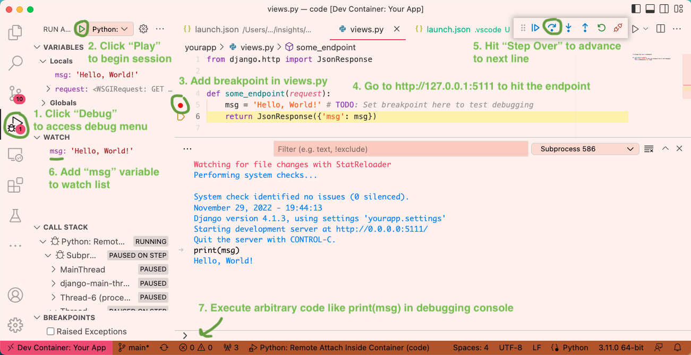

# django-debug-vscode-docker-devcontainer
Scaffolding to set up Django in Docker with VS Code using Dev Containers

# Setup
- Open this folder in VS Code.

- You should see a dialog box pop up that says "Reopen in Container", say yes.

- Python [Dev Container](https://code.visualstudio.com/docs/containers/quickstart-python) startup is still wonky. You might have to close out and "Reopen in Container" a second time if the post-create commands and Python extensions don't load up immediately.

- Click the "Debug" menu icon on the left pane, then click the "Play" button to run the debugger. This screenshot shows the various things you should do **in green**, which are numbered.

- The web app can be accessed at [127.0.0.1:5111](http://127.0.0.1:5111) or any hostname you've set up in `/etc/hosts` to test breakpoints.
